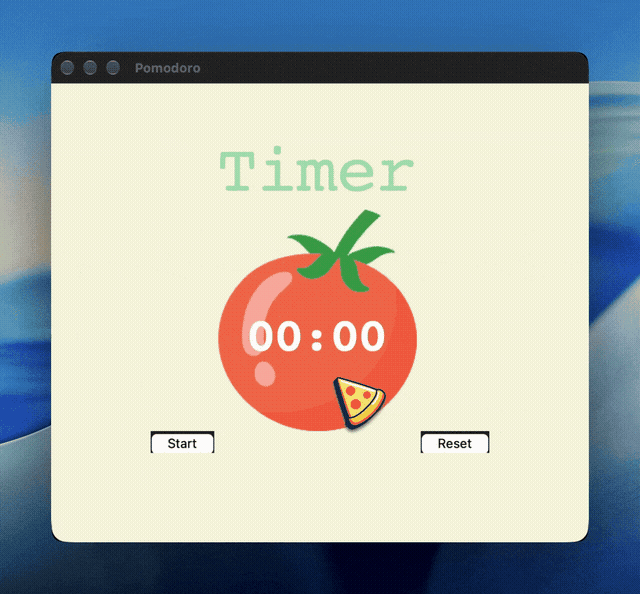
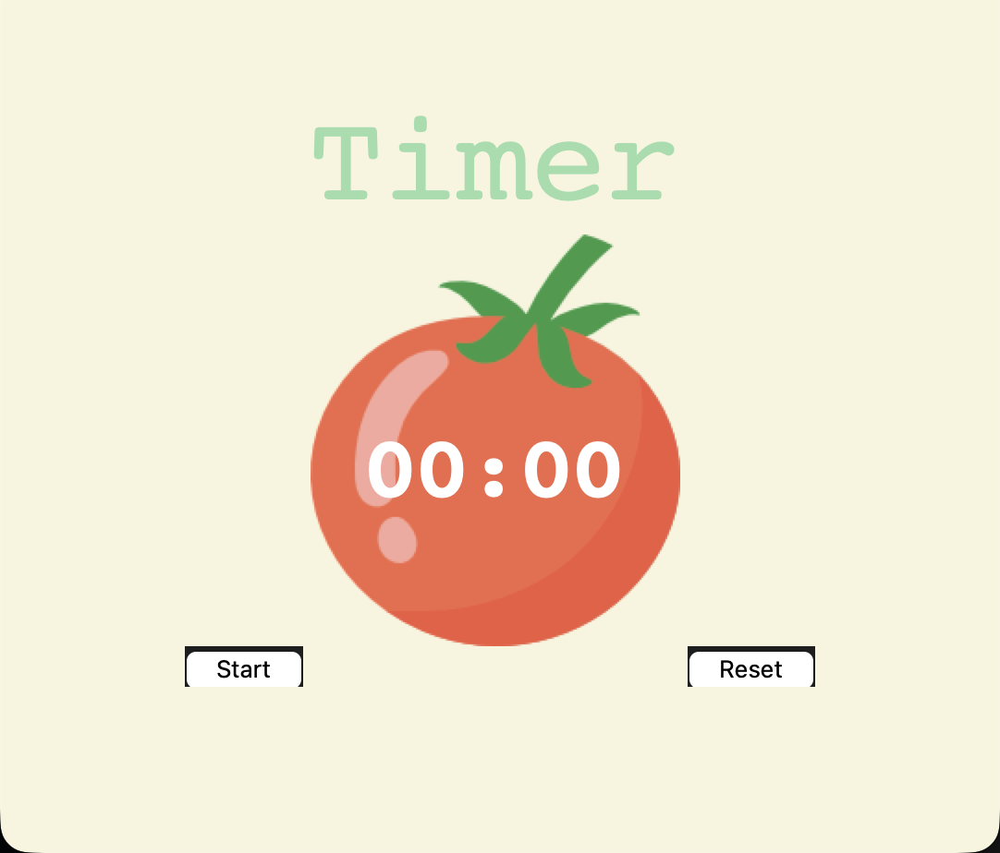

# 🍅 Pomodoro GUI Timer

<div align="center">


A clean, distraction-free desktop Pomodoro timer built with Python and Tkinter. Designed to boost focus and productivity using the time-tested Pomodoro Technique.

<br/>



</div>

---

## 🎬 Demo & Visuals

| Animated Demo | High-Resolution Interface |
| :---: | :---: |
| <br/><sub>Interactive Demo Preview</sub> | <br/><sub>Clean Minimalist UI</sub> |

---

## 📖 About the Project

The **Pomodoro Technique** is a proven time-management method developed by Francesco Cirillo in the late 1980s. It uses a timer to break down work into intervals, traditionally **25 minutes** in length, separated by **short breaks (5 minutes)**. After **4 work sessions**, a **longer break (20 minutes)** is taken.

This application provides an intuitive desktop interface with:
- Visual tomato countdown canvas.
- Color-coded phase indicators (**Work** 🟢, **Short Break** 🌸, **Long Break** 🔴).
- Session checkmark accumulation.
- Seamless **Start**, **Pause**, and **Resume** capabilities.
- Audio and window alerts when sessions complete.

---

## ✨ Features

- **⏱️ Start / Pause / Resume Controls**: Single-button state handling allows pausing when interrupted and resuming without losing time or spawning overlapping timers.
- **🔄 Robust Reset Mechanism**: Instantly stops active countdowns, restores initial timer display, clears checkmarks, and resets UI colors cleanly.
- **✔️ Visual Progress Tracking**: Earn a checkmark (`✔`) for each completed work session (up to 4 checkmarks per full cycle).
- **🎨 Dynamic Phase Colors**:
  - 🟢 **Work Phase** (25 min) &mdash; Fresh green theme.
  - 🌸 **Short Break** (5 min) &mdash; Soft pink theme.
  - 🔴 **Long Break** (20 min) &mdash; Vibrant red theme.
  - 🎉 **Cycle Complete** &mdash; Displays "Done!" chime notification.
- **🔔 Desktop Notification**: Chimes the system bell and brings the window forward upon session completion so you never miss a transition.
- **🛡️ Cross-Platform & Directory-Independent**: Uses dynamic asset resolution so the app runs smoothly from any working directory.
- **💡 Beginner-Friendly Code**: Written cleanly with clear explanations, structured sections, and easy-to-modify constants.

---

## 🚀 Getting Started

### Prerequisites

- Python 3.8 or higher.
- `tkinter` (bundled with most Python installations on macOS and Windows).

> On Linux (Ubuntu/Debian), install Tkinter if not already present:
> ```bash
> sudo apt-get install python3-tk
> ```

### Installation

1. **Clone the repository:**
   ```bash
   git clone https://github.com/MSameer7-tech/GUI-Pomodoro-App.git
   cd GUI-Pomodoro-App
   ```

2. **Run the application:**
   ```bash
   python3 main.py
   ```

---

## 🎮 How to Use

1. Click **Start** to begin your first 25-minute focus session.
2. If interrupted, click **Pause** to freeze the timer, and click **Resume** when ready to continue.
3. When the 25 minutes are up:
   - A chime rings and the window surfaces.
   - The app automatically transitions to a 5-minute **Short Break**.
   - A checkmark (`✔`) is awarded.
4. After 4 completed work sessions, the app rewards you with a 20-minute **Long Break**.
5. Click **Reset** at any time to return the timer to its initial state.

---

## ⚙️ Customization

You can easily adjust the interval durations by modifying the constants at the top of [`main.py`](main.py):

```python
# ---------------------------- CONSTANTS ------------------------------- #
WORK_MIN = 25          # Work duration in minutes
SHORT_BREAK_MIN = 5    # Short break duration in minutes
LONG_BREAK_MIN = 20    # Long break duration in minutes
```

---

## 📁 Project Structure

```text
GUI-Pomodoro-App/
├── assets/
│   ├── Python.gif         # Animated demo recording of the app
│   └── screenshot.png     # Static UI screenshot
├── main.py                # Main application logic & Tkinter UI
├── tomato.png             # Tomato graphic for timer canvas
├── .gitignore             # Git ignore rules
├── LICENSE                # MIT License
└── README.md              # Project documentation
```

---

## 🤝 Contributing

Contributions, issues, and feature requests are welcome! Feel free to check the [issues page](https://github.com/MSameer7-tech/GUI-Pomodoro-App/issues).

---

## 📝 License

This project is licensed under the [MIT License](LICENSE).
